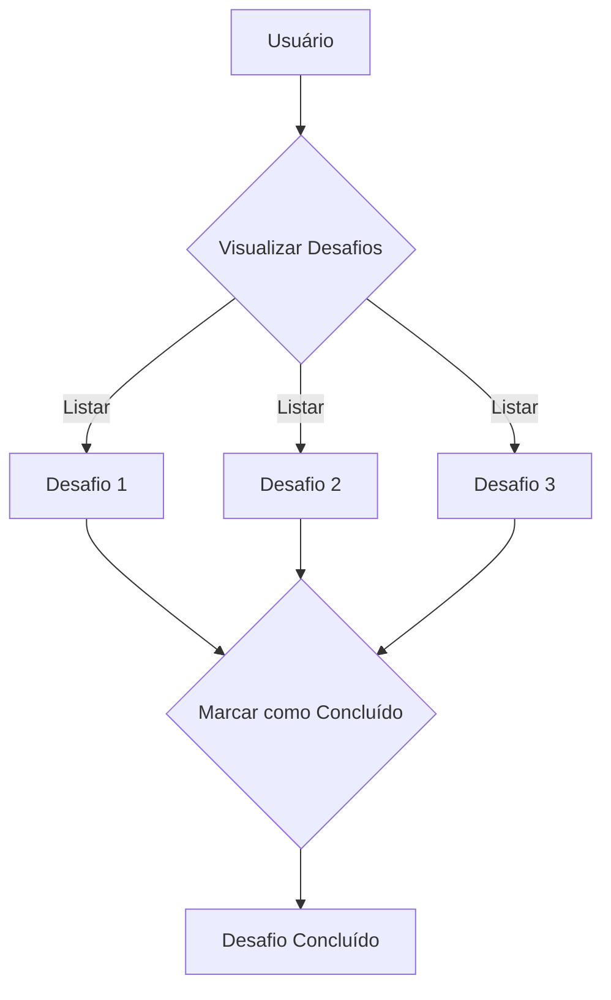

# Podio-E Prototype App

### Equipe
- **Guilherme de Oliveira - rm558797**
- **Rafael Panhoca - rm555014**
- **Tatiana Thamye - rm554605**
- **João Vitor Leodoro - rm555052**
- **Victor Hugo - rm559094**

## Descrição do Projeto

O Podio-E é uma plataforma gamificada focada em Atividade Física, Sustentabilidade e Tecnologia. Este projeto é um protótipo de aplicativo que permite aos usuários visualizar os desafios propostos pela plataforma e marcar atividades como concluídas.

## Diagrama de Blocos



## Bibliotecas Utilizadas

- **Flet**: Uma biblioteca que permite criar aplicativos web de maneira simples e eficiente.

## Instalação do Flet

Para instalar o Flet, siga as instruções abaixo:

1. **Certifique-se de ter o Python instalado** em seu sistema. Você pode baixá-lo em [python.org](https://www.python.org/downloads/).

2. **Instale a biblioteca Flet** utilizando o seguinte comando:

   ```bash
   pip install flet
   ```

## Executando o Aplicativo

Para executar o aplicativo na versão web, siga os passos abaixo:

1. **Clone o repositório** ou baixe o código-fonte do projeto.
   
   ```bash
   git clone <URL_DO_REPOSITORIO>
   ```

2. **Navegue até o diretório do projeto**.

   ```bash
   cd <DIRETORIO_DO_PROJETO>
   ```

3. **Ative o ambiente virtual** criado na pasta do projeto. O comando pode variar dependendo do sistema operacional:

   - **Windows**:

     ```bash
     .\venv\Scripts\activate
     ```

   - **Linux ou macOS**:

     ```bash
     source venv/bin/activate
     ```

4. **Execute o aplicativo** utilizando o seguinte comando:

   ```bash
   flet run --web app.py
   ```

5. **Ou** apenas faça o passo **1** e **2**, depois faça o passo **4** tambem rodara o app.

## Funcionalidades

- Visualizar desafios propostos pela plataforma.
- Marcar desafios como concluídos.
